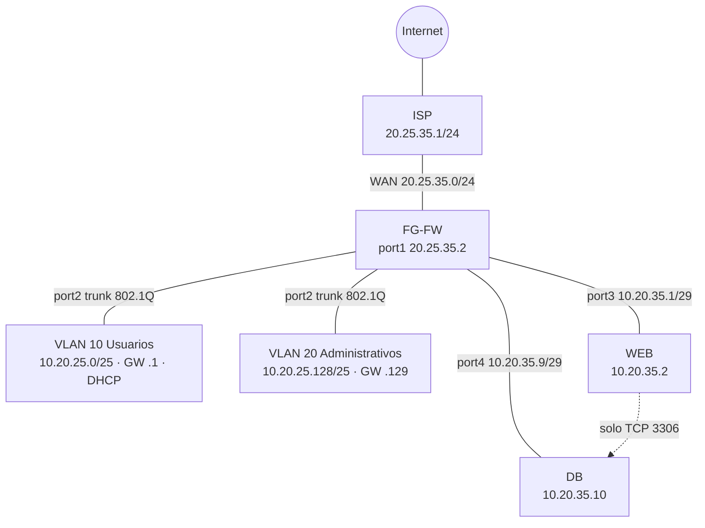

# Parcial FortiGate – Gregorys Morel Duluc (2025-0035)

**Video de demostración:** https://youtu.be/xmxBJhgFVKc

## Propósito del laboratorio
Diseñar e implementar una infraestructura de red segura con FortiGate (FortiOS 7.0.9), configurado por interfaz gráfica, que aplique segmentación por VLANs con direccionamiento basado en la matrícula, salida a Internet con NAT, microsegmentación del Web Server, prevención de SQL Injection con cuarentena del atacante y filtrado web con página de violación de política.

## Topología

| Equipo | Función |
|---|---|
| FG-FW | Firewall central (FortiGate VM 7.0.9) |
| ISP | Router de proveedor con salida real a Internet |
| WEB | Servidor web Linux (nginx) |
| DB | Servidor de base de datos Linux |
| PC-V10 / PC-V20 | Usuarios de VLAN 10 y VLAN 20 |

## Direccionamiento basado en la matrícula 2025-0035
| Segmento | Red | Gateway / IPs |
|---|---|---|
| WAN FG ↔ ISP | 20.25.35.0/24 | ISP 20.25.35.1 · FG port1 20.25.35.2 |
| VLAN 10 – Usuarios (DHCP) | 10.20.25.0/25 | 10.20.25.1 · DHCP .10 – .100 |
| VLAN 20 – Administrativos | 10.20.25.128/25 | 10.20.25.129 |
| Servidores /28 (10.20.35.0/28) – WEB | 10.20.35.0/29 | FG port3 10.20.35.1 · WEB 10.20.35.2 |
| Servidores /28 (10.20.35.0/28) – DB | 10.20.35.8/29 | FG port4 10.20.35.9 · DB 10.20.35.10 |

Los octetos 20.25 y 35 provienen de la matrícula 2025-0035. La red de servidores /28 se divide en dos segmentos para que todo el tráfico WEB → DB atraviese el FortiGate y quede sujeto a política.

## Implementación

### Hostname

### Interfaces

### VLAN 10 (/25 con DHCP) y VLAN 20 sobre trunk 802.1Q en port2

### Ruta por defecto y NAT
Ruta 0.0.0.0/0 hacia el ISP (20.25.35.1). Las políticas de VLAN 10 y VLAN 20 hacia port1 aplican NAT con la IP de la interfaz de salida.

### Objetos y servicio
Objetos de host para WEB y DB, objetos FQDN de los endpoints de actualización agrupados en UPDATES, y servicio MARIADB (TCP 3306).

### Políticas de firewall
| Política | Origen → Destino | Servicio | Acción |
|---|---|---|---|
| V10-INTERNET | vlan10 → port1 | ALL | Accept + NAT |
| V20-INTERNET | vlan20 → port1 | ALL | Accept + NAT |
| V10-WEB | vlan10 → WEB | HTTP | Accept + IPS-SQLI + WF-INVENTARIO |
| V20-WEB | vlan20 → WEB | HTTP, PING | Accept + IPS-SQLI |
| WEB-DB | WEB → DB | MARIADB (3306) | Accept |
| WEB-UPDATES | WEB → UPDATES | HTTP, HTTPS, DNS | Accept + NAT |
| WEB-DENY | WEB → port1 | ALL | Deny + log |

### IPS contra SQL Injection con cuarentena
Perfil IPS-SQLI con las firmas de SQL Injection en acción Quarantine (5 minutos), aplicado a las políticas hacia el Web Server.

### Web Filter y página de violación de política
Perfil WF-INVENTARIO que bloquea 10.20.35.2/inventario, aplicado a la política de la VLAN 10.

### Servidor web HTTP

### Microsegmentación: salida del Web Server bloqueada
El Web Server no puede hacer ICMP ni navegar a Internet abierto; solo se permite 3306 hacia DB y los endpoints de actualización.

### Salida a Internet: ping y traceroute

## Configuraciones
| Archivo | Equipo |
|---|---|
| [configs/FG-FW_7-0Backup.conf](configs/FG-FW_7-0Backup.conf) | FortiGate |
| [configs/ISP.rsc](configs/ISP.rsc) | Router ISP |
| [configs/WEB-nginx.conf](configs/WEB-nginx.conf) | Web Server |
